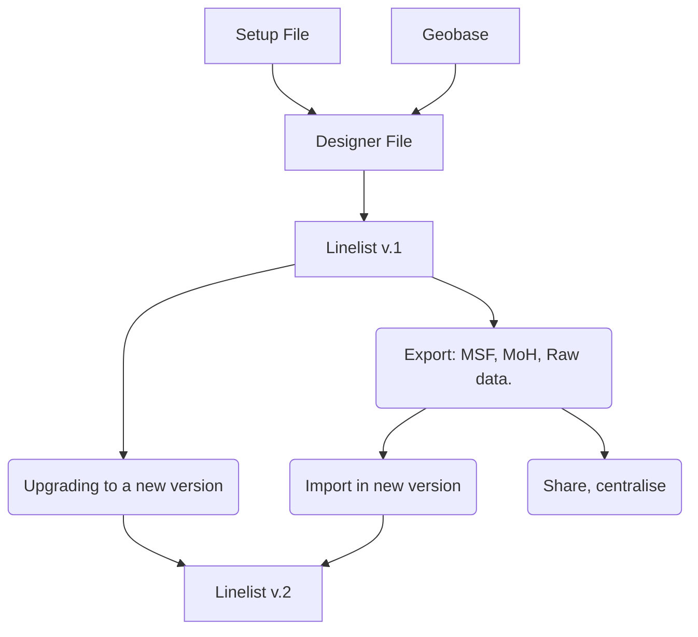

# Show case of outbreak-tools usage

*Excercises and show-case of
[outbreak-tools](https://github.com/epicentre-msf/outbreak-tools/) and
[outbreak-tools-setup](https://github.com/epicentre-msf/outbreak-tools-setup/).*

## Introduction

Outbreak-tools is a set of tools to facilitate the creation of linelists
in Excel. Among other things, these tools allow you to automate:

- Adding variables (whether drop-down lists, integer or decimal values,
  or even Excel formulas) and format them.
- Translating a linelist from one language to another,
- Adding analyses to the linelist in tabular form (univariate,
  bivariate, temporal, spatial),
- Adding graphs to the linelist,
- Import/export the entire linelist or selected variables into specific
  formats.
- Managing geographic data in the linelist.
- Migration of the linelist as options/variables are added or removed.

The linelist is designed in a configuration file called *setup*. This
*setup* file is then loaded into another file that designs the linelist
called *designer*. The designer creates the linelist, based on the
configurations of the *setup*. The linelist creation procedure is a
3-step process:

1- Define your needs in the setup file: The configuration of the file is
inspired from Kobo’s XLS forms. No in-depth knowledge of Excel is
required. A setup file is defined by disease, and can be used to create
linelists in several languages.

2- Download geographic data for the targeted area: There is [an
application](https://reports.msf.net/secure/app/outbreak-tools-geoapp)
available online to download geographic data for the region of interest.
It is updated as new geographical information becomes available.

3- Generate the linelist by specifying the options in the designer.

# Exercises

This series of 3 exercises explores the possibilities mentioned above,
using a measles setup file. The folders contain all the materials needed
to perform the exercises.

> **Download and unzip the materials**
>
> You can download the exercices in `zip` file for offline use
> [here](https://github.com/epicentre-msf/outbreak-tools-demo/raw/main/demo-materials.zip).
> **Extract the zip files after the download.**

> **Activate macros before exercises**
>
> If you’re going to run the designer to build a linelist, you’ll need
> to enable VBA macros in Excel, as well as access to the VBA object
> model:
>
> 0- Open Excel
>
> 1- Display the *Developer* tab in Excel.
>
> 2- In the *Developer* tab, click on *Macro security*. Check the
> options as shown in the following image:
>
>  data-fig-align="center" />
>
> On some Windows machine, you will need to unblock downloaded files to
> be able to use macros. In some cases, excel macro files downloaded
> from the web are automatically blocked for security reasons. You can
> unblock the files by:
>
> 0- Right click on the file
>
> 1- Select Properties
>
> 2- Check the *Unblock* box on the bottom right.

## Exercise 1: Exploration.

- Open the file `linelist_measles_en_ex1.xlsb` located in the `linelist`
  folder. The file password is 5678.

- Browse the linelist sheets.

- Fill in geographical data using the geo-Helper. Select the data you
  want.

- Explore univariate, bivariate and temporal analyses. Recompute the
  same analyses by filtering on people under 2 years of age.

- Export the filtered data with the anonymous export for MSF. Open and
  browse the exported file. If you didn’t change the exports password,
  the password should be: **605637**.

## Exercise 2: Modifying the setup file

- Open the setup file `setup_measles_base_ex2.xlsb` in the `setup`
  folder. We want to add the following variables:

  - In the *Admission* section of *Linelist patients* sheet, just before
    the *hospitalisation* sub-section:
    - `muac` (MUAC) which takes three values: “Green (125+mm)”, “Yellow
      (115-124mm)”, “Red (\< 115mm)”
  - In the *Vaccination* section of *Linelist patients* sheet, just
    after *Vaccination against measles*:
    - `vacci_measles_doses` (Number of doses received) which is a
      numeric variable.
    - Add a validation to this variable to make sure it’s between 0 and
      4.

- Translate the added labels into French

- Check the setup for errors.

> **Note**
>
> *You should normally have a configuration file identical to*
> *`setup_measles_exercise_two.xlsb` in the* *`setup` folder. You can
> also start from this file if you like.*

- Regenerate a new linelist named `linelist_measles_en_ex2` using the
  designer. Save the linelist in the demo folder, making sure you’ve
  selected English as the language. You’ll use the file
  `geobase-cod-2023-03-13_20230612.xlsx` in the `geobase` folder as your
  geobase.

- Import the data `import_linelist_en.xlsx` located in the `data` folder
  into the linelist. Look at the data that has not been imported and
  browse the data in the linelist.

## Exercise 3: Analysis

We’ve decided to add some analyses to the `outcome` file.

- Open the setup `setup_measles_base_ex3.xlsb` in the `setup` folder.

- In the analyses sheet, add a univariate table showing the number of
  patients by type of discharge. Add percentages and a graph for this
  table.

- In the analyses sheet, add a temporal table showing the evolution of
  type of discharge by notification date. Add a percentage option in
  row, and add a total.

- In the analysis sheet, add a graph of output types. In graph
  specifications, represent the number of deaths per notification date,
  in bars.

- Translate all labels into French.

- Check the setup for errors.

> **Note**
>
> *You should get a configuration file identical to
> `setup_measles_exercise_three.xlsb` in* *the `setup` folder. You can
> also start from this file if you like.*

- Regenerate a new linelist named `linelist_measles_en_ex3` using the
  designer. Save the linelist in the demo folder, making sure you’ve
  selected English as the language.

- Import the data `import_linelist_en.xlsx` located in the `data` folder
  into the linelist. Look at the data that has not been imported and
  browse the data in the linelist.

- Print the `Linelist patients` sheet.
