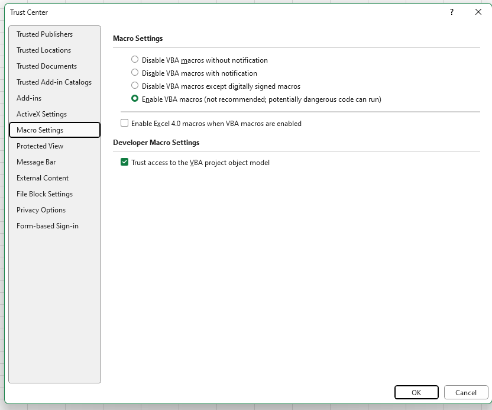

## Outbreak-Tools demo
_Excercises and show-case of [outbreak-tools](https://github.com/epicentre-msf/outbreak-tools/) and [outbreak-tools-setup](https://github.com/epicentre-msf/outbreak-tools-setup/)._

### Introduction to the outbreak-tools

Outbreak-tools is a set of tools to facilitate the creation of linelists
in Excel. Among other things, these tools allow you to automate:

- Adding variables (whether drop-down lists, integer or decimal values, or even Excel formulas) and format them. 
- Translating a linelist from one language to another,
- Adding analyses to the linelist in tabular form (univariate, bivariate, temporal, spatial),
- Adding graphs to the linelist,
- Import/export the entire linelist or selected variables into specific formats.
- Managing geographic data in the linelist.
- Migration of the linelist as options/variables are added or removed.

# Exercises

_You can [download](https://github.com/epicentre-msf/outbreak-tools-demo/raw/main/demo-materials.zip) the current exercise for offline use._

This series of 3 exercises explores the possibilities mentioned above, using a measles setup file. The folders contain all the materials needed to perform the exercises.

::: {.callout-important title="Activate macros before exercises"}

  If you're going to run the designer to build a linelist, you'll need to enable VBA macros in Excel, as well as access to the VBA object model:

  1- Display the _Developer_ tab in Excel.

  2- In the _Developer_ tab, click on _Macro security_. Check the options as shown in the following image:

  {width=80% fig-align="center"}

:::

## Exercise 1: Exploration.

- Open the file `linelist_measles_en_ex1.xlsb`. The file password is 1234.

- Browse the linelist sheets.

- Fill in geographical data using the geo-Helper. Select the data you want.

- Explore univariate, bivariate and temporal analyses. Recompute the same analyses by filtering on people under 2 years of age.

- Export the filtered data with the anonymous export for MSF.

## Exercise 2: Modifying the setup file

- Open the setup file `setup_measles_base_ex2.xlsb`. We want to add the following variables:

  - In the _Admission_ section, just before the _hospitalization_ sub-section:
    - `muac` (MUAC) which takes three values: "Green (125+mm)", "Yellow (115-124mm)", "Red (< 115mm)"

  - In the _Vaccination_ section, just after _Vaccination against measles_:
    - `vacci_measles_doses` (Number of doses received) which is a numeric variable.
    - Add a validation to this variable to make sure it's between 0 and 4.

- Translate the added labels into French

- Check the setup for errors.

::: {.callout-note}
_You should normally have a configuration file identical to `setup_measles_exercise_two.xlsb`. You can also start from this file if you like._
:::

- Regenerate a new linelist with the designer named 
`linelist_measles_en_ex2` in the demo folder, making sure you've selected English as the language. 
You'll use the file `geobase-cod-2023-03-13_20230612.xlsb` as your geobase.

- Import the data `import_linelist_en.xlsb` into the linelist. Look at the data that has not been imported and browse the data in the generated linelist.

## Exercise 3: Analysis

We've decided to add some analyses to the `outcome` file.

- Open the setup `setup_measles_base_ex3.xlsb`.

- In the analyses sheet, add a univariate table showing the number of patients by type of discharge. Add percentages and a graph for this table.

- In the analyses sheet, add a temporal table showing the evolution of discharge types by notification date. Add a percentage option in row, and do not add a total.

- In the analysis sheet, add a graph of output types. In
graph specifications, represent the number of deaths per notification date, in bars.

- Translate all labels into French

- Check the setup for errors.

::: {.callout-note}
_You should get a configuration file identical to `setup_measles_exercise_three.xlsb`. You can also start from this file if you like._
:::

- Regenerate a new linelist with the designer called 
`linelist_measles_en_ex3` in the demo folder, making sure you've selected English as the language.

- Import the data `import_linelist_en.xlsb` into the linelist. Browse the generated linelist data.

- Print the `Patient linelist` sheet.

